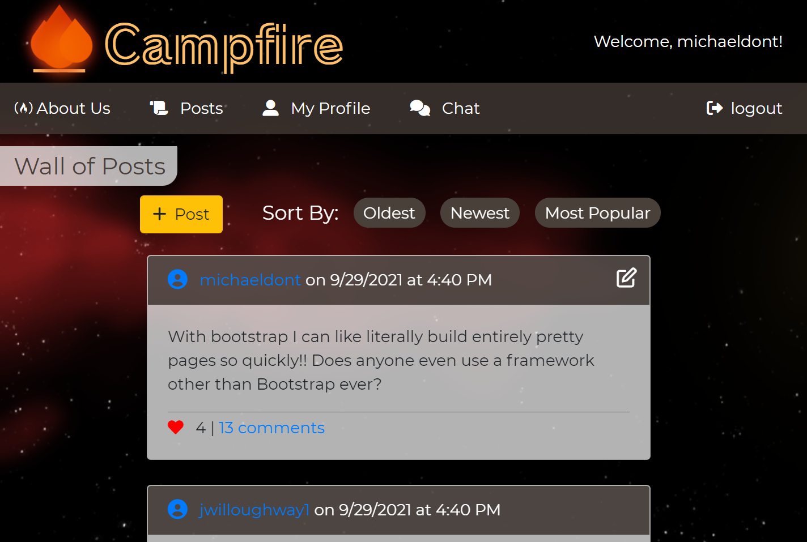
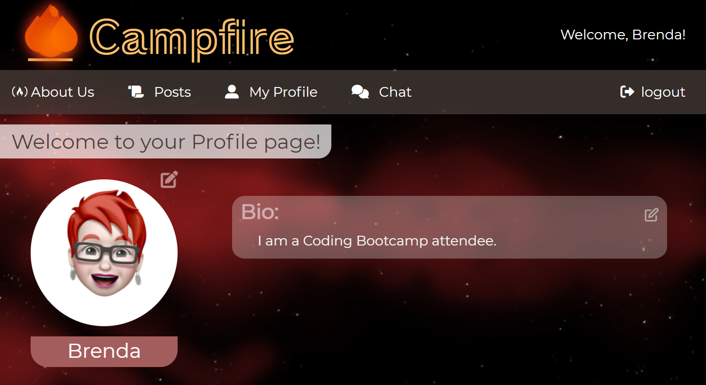
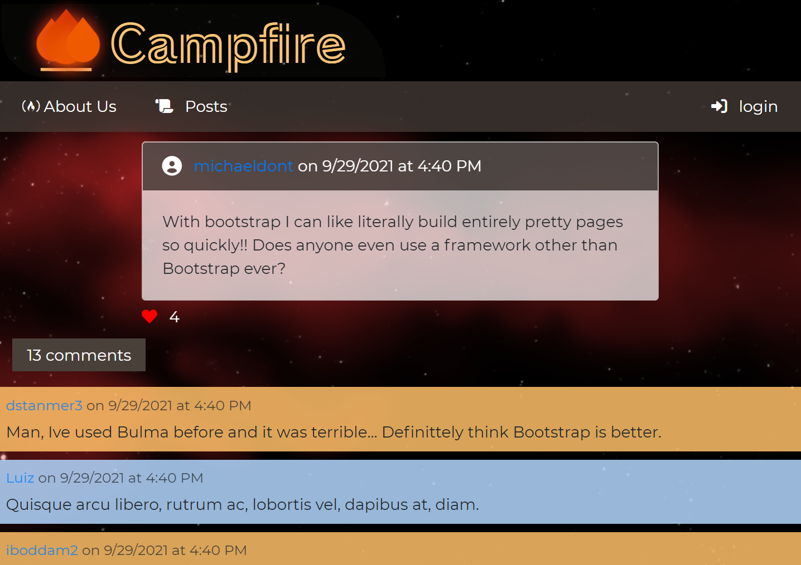

# Campfire

## Table of Contents

* [Description](#description)

* [Contributors](#contributors)

* [Technologies Used](#techUsed)

* [Credits](#credits)

* [Usage](#usage)

* [Future Enhancements](#futurePlans)

* [Deployed Application](#deployedApp)

* [Gallery](#gallery)

---

## Description

Campfire is a communication app for Coding Bootcamp attendees.

Campfire was created to serve as the go to social media of a Coding Bootcamp student. In this application, old and new students will have the opportunity to bond and network with one another in a more direct way than they do during classes or through Slack. When joining the application, students will find others who are going through similar experiences and obstacles. Hence, users are guaranteed to make significant connections with one another. 

Since users will have the ability post about new technologies that they have tried or want to learn about, and also check what other users have been posting lately, this app will serve users as a source of knowledge about revolutionary technologies, as well as a source of help with technologies that are new to the students.

---

## Contributors
* Aidan Amato: https://github.com/aidanamato
* Michael Astalos: https://github.com/mtastalos
* Brenda Jackels: https://github.com/bjackels5
* Luiz Padredi: https://github.com/Padredilg

--- 

## Technologies Used
* HTML
* CSS
* Javascript
* [GitHub](https://github.com/)
* [Bootstrap](https://getbootstrap.com/)
* [Node.js](https://nodejs.org/en/)
* [Express](https://expressjs.com/)
* [MySQL](https://www.mysql.com/)
* [dotenv](https://www.npmjs.com/package/dotenv)
* [Heroku](https://id.heroku.com/login)
* [jawsDB](https://www.jawsdb.com/)
* [Sequelize](https://sequelize.org/)
* [Bcrypt](https://www.npmjs.com/package/bcrypt)
* [express-session](https://www.npmjs.com/package/express-session)
* [Handlebars](https://handlebarsjs.com/)
* [Socket.IO](https://socket.io/)
* [Browserify](https://browserify.org/)
* [Uppy](https://uppy.io/)

---

## Credits
* [SED Innovations: Cloudy and starry night background animation](https://codepen.io/WebSonick/pen/vjmgu)
* [Speckyboy: It's Bubbly Flame Effect](https://speckyboy.com/flame-effects-code-snippets/)
* Fontawesome Icons:
   - [free-code-camp](https://fontawesome.com/v5.15/icons/free-code-camp?style=brands)
   - [scroll](https://fontawesome.com/v5.15/icons/scroll?style=solid)
   - [user-alt](https://fontawesome.com/v5.15/icons/user-alt?style=solid)
   - [comments](https://fontawesome.com/v5.15/icons/comments?style=solid)
   - [sign-in-alt](https://fontawesome.com/v5.15/icons/sign-in-alt?style=solid)
   - [sign-out-alt](https://fontawesome.com/v5.15/icons/sign-out-alt?style=solid)
   - [user-circle](https://fontawesome.com/v5.15/icons/user-circle?style=solid)
   - [heart](https://fontawesome.com/v5.15/icons/heart?style=solid)
   - [plus](https://fontawesome.com/v5.15/icons/plus?style=solid)
   - [arrow-up](https://fontawesome.com/v5.15/icons/arrow-up?style=solid)
   - [trash-alt](https://fontawesome.com/v5.15/icons/trash-alt?style=solid)

--- 

## Usage

#### About Us Page: 
   - This Page provides the user with a brief explanation of what Campfire is about.
#### Login/Sign-Up form
   - The user may create an account or login from an account previously created to experience 100% of the functionalities of Campfire
   - A user who has not logged in may check the About Us page, the Posts Wall, and see the Comments and count of likes in a post. They may not, however, add loves, add comments, add posts, nor use the Live Chat.
#### Wall of Posts
   - This page contains a list of all of the posts that users have created. 
   - Clicking on the name of the author of a post will redirect the page to that user's profile page.
   - A user who is logged in may:
      - Edit or delete their own posts, as well as create new ones from scratch.
      - Delete any comments from their own posts.
      - Add and delete their own comments from other people's posts
      - Add or Remove Loves from posts
#### Profile
   - Each user who has created an account gets access to their own profile page. In there, the user can upload a picture, update the Bio, and also check their posts that are currently in the Wall of Posts.
#### Live-Chat
   - This page contains a live-chat that displays messages that every user is currently sending, so several users can hold a conversation at the same time.

---

## Future Enhancements

* "Like" functionality: from post wall, and click the heart instead of a separate button.
* Ability to "Like" comments.
* Persistent Chat Rooms
* Private Chat Rooms
* Ability to list projects and apps on Profile page
* Friendship
* Filter Posts by Friends
* Links to profile include the pic

---

## Deployed Application
You may access Campfire through this [link](https://campfire-social-media.herokuapp.com).

---

## Gallery

#### About Us

#### Profile Page

#### Example of a Post

